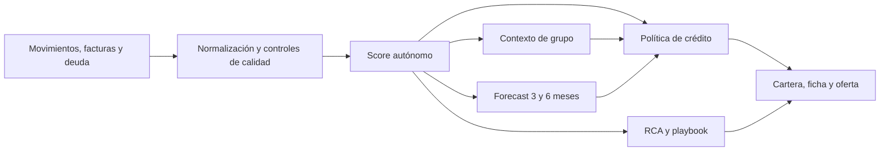

# Embat Flow

**Inteligencia financiera continua para convertir datos de tesorería en decisiones de financiación explicables.**

Embat Flow analiza movimientos bancarios, facturas, deuda y relaciones de grupo
para medir mensualmente la salud financiera de una empresa, anticipar su
evolución y traducirla en una política de circulante: elegibilidad, límite,
plazo, precio y acciones de seguimiento.

> [Abrir Embat Flow en Vercel](https://hackspain-2026-airbenders.vercel.app/cartera?mes=2026-08)
>
> La aplicación está desplegada con los datos y resultados ya cargados. Para
> explorar el producto no hace falta clonar el repositorio, instalar
> dependencias ni configurar una base de datos.

El entorno web utiliza el corte de **agosto de 2026** y el contrato de cálculo
`scoreSolo-holding-v7`.

## Qué problema resuelve

La financiación empresarial suele apoyarse en fotografías contables antiguas,
procesos manuales y una visión fragmentada por banco o sociedad. Embat Flow
convierte la información operativa disponible en Embat en una lectura mensual,
trazable y accionable.

| Enfoque tradicional                        | Embat Flow                                            |
| ------------------------------------------ | ----------------------------------------------------- |
| Revisión anual o puntual                   | Revisión mensual                                      |
| Información contable con varios meses      | Movimientos bancarios y facturas recientes            |
| Visión aislada de cada sociedad            | Lectura autónoma y contexto del grupo empresarial     |
| Una nota difícil de justificar             | Score, evidencia, umbrales y controles explicables    |
| Condiciones estáticas                      | Límite, plazo y precio revisados de forma progresiva  |
| Reacción cuando el problema ya es evidente | Alertas, previsión y cambios de trayectoria tempranos |

El resultado no es una caja negra ni una probabilidad de impago. Es una capa
de decisión determinista que permite entender qué está ocurriendo, qué señales
sostienen el diagnóstico y qué condiciones permite una política de crédito.

## Para quién es

Embat Flow conecta tres perspectivas sin confundir sus responsabilidades:

| Actor                       | Qué obtiene                                                                  |
| --------------------------- | ---------------------------------------------------------------------------- |
| **Empresa, tesorero o CFO** | Su salud financiera, benchmark, evolución, oferta y palancas de mejora       |
| **CFO de grupo**            | Exposición conjunta, apoyos, drenajes de caja y efectos entre sociedades     |
| **Partner financiero**      | Una cartera priorizada, decisiones explicadas y seguimiento mensual          |
| **Embat**                   | Un módulo de financiación de circulante integrado sobre sus datos operativos |

La empresa conserva el control de la relación: el producto está diseñado para
compartir con el partner el score, su explicación y la oferta únicamente cuando
la empresa decide solicitar circulante. Los movimientos, facturas y saldos en
bruto no forman parte del informe compartido.

## Capacidades del producto

| Módulo                    | Pregunta que responde                                | Resultado                                                |
| ------------------------- | ---------------------------------------------------- | -------------------------------------------------------- |
| **Scoring financiero**    | ¿Cómo está la empresa al cierre de este mes?         | Score 0–100, confianza, estados, bloques y señales       |
| **Contexto de holding**   | ¿El grupo sostiene o presiona a la sociedad?         | `scoreSolo`, `scoreGrupo`, ajuste y condiciones de grupo |
| **Forecast**              | ¿Qué ocurriría si continúa la evolución observada?   | Previsiones a 3 y 6 meses con intervalos                 |
| **Motor de decisión**     | ¿Qué financiación permite la política?               | Elegibilidad, límite, plazo, TAE, menú y acción mensual  |
| **Alertas e inflexiones** | ¿Qué está mejorando o deteriorándose?                | Cambios confirmados, dirección y señales tempranas       |
| **Playbook de tesorería** | ¿Qué conviene revisar primero?                       | Hallazgos, presiones, mejoras y acciones sugeridas       |
| **Pares y benchmark**     | ¿Cómo se sitúa frente a empresas comparables?        | Cohorte anonimizada y distribución de referencia         |
| **Backtesting**           | ¿Cómo se comporta el sistema fuera del ajuste?       | Métricas de anticipación, estabilidad y error            |
| **Exportación**           | ¿Cómo se integran los resultados con otros procesos? | CSV, JSONL y endpoints de consulta versionados           |

## Cómo funciona



1. **Normalización.** Convierte importes a euros, separa operación, deuda y
   transferencias, reconstruye la evidencia útil y conserva la falta de datos.
2. **Scoring.** Calcula 14 variables agrupadas en liquidez y deuda (A),
   fiabilidad de pagos (B) y relaciones comerciales (C).
3. **Holding.** Mantiene separadas la capacidad autónoma de la sociedad y la
   influencia de su grupo.
4. **Forecast.** Proyecta el score a 3 y 6 meses bajo continuidad de las señales
   observadas.
5. **Decisión.** Aplica controles de acceso, límites, plazos, precios,
   condiciones y memoria mensual.
6. **Explicación.** Identifica cambios materiales desde una inflexión y propone
   un playbook operativo sin atribuir causalidad no observada.

Todos los motores validan sus entradas y salidas con contratos Zod. La versión,
el hash de parámetros y la huella del dataset impiden mezclar ejecuciones
incompatibles. Ningún LLM decide la elegibilidad, el límite, el plazo o el
precio.

## Explorar la aplicación

La entrada recomendada es la cartera de agosto de 2026:

### [Abrir la cartera](https://hackspain-2026-airbenders.vercel.app/cartera?mes=2026-08)

Desde la navegación principal se puede acceder a:

| Vista             | Acceso directo                                                             | Qué permite hacer                                            |
| ----------------- | -------------------------------------------------------------------------- | ------------------------------------------------------------ |
| **Cartera**       | [Abrir](https://hackspain-2026-airbenders.vercel.app/cartera?mes=2026-08)  | Filtrar empresas por estado, acción, banda y previsión       |
| **Vista empresa** | [Abrir](https://hackspain-2026-airbenders.vercel.app/empresa?mes=2026-08)  | Consultar score, benchmark, oferta y solicitud de circulante |
| **Grupos**        | [Abrir](https://hackspain-2026-airbenders.vercel.app/grupos?mes=2026-08)   | Analizar exposición, apoyo y presión dentro de un holding    |
| **Alertas**       | [Abrir](https://hackspain-2026-airbenders.vercel.app/alertas?mes=2026-08)  | Revisar mejoras y deterioros confirmados                     |
| **Pares**         | [Abrir](https://hackspain-2026-airbenders.vercel.app/pares?mes=2026-08)    | Comparar hasta tres empresas con el mismo marco              |
| **Backtest**      | [Abrir](https://hackspain-2026-airbenders.vercel.app/backtest?mes=2026-08) | Consultar el comportamiento histórico de scoring y forecast  |

Los filtros, el mes, las empresas seleccionadas y la pestaña activa viven en
la URL. Cualquier análisis puede compartirse mediante un enlace reproducible.

## Casos de uso implementados

### 1. La misma nota no implica la misma decisión

[`COMP_0484` frente a `COMP_0875`](https://hackspain-2026-airbenders.vercel.app/pares?mes=2026-08&empresas=COMP_0484,COMP_0875)

Las dos empresas rondan los 61 puntos, pero presentan distinta profundidad de
histórico, confianza, señales de fiabilidad y trayectoria. El caso muestra por
qué el score ordena mientras la evidencia explica, y por qué una conclusión
coincidente no implica un diagnóstico idéntico.

[Leer el caso completo](./docs/demo/use_cases_implementados/01-misma-nota-dos-empresas.md)

### 2. El holding puede sostener o drenar caja

[`GROUP_0217`: `COMP_0512` y `COMP_0926`](https://hackspain-2026-airbenders.vercel.app/cartera?mes=2026-08&grupo=GROUP_0217&pestana=decision)

Dos sociedades del mismo grupo muestran efectos opuestos. Una recibe apoyo y
otra aporta caja al holding. El caso separa capacidad autónoma, contexto de
grupo, controles de acceso y techo de exposición compartido.

[Leer el caso completo](./docs/demo/use_cases_implementados/02-holding-absorbe-y-drena.md)

El [catálogo de casos de uso](./docs/demo/README.md) añade escenarios de
impago con nota alta, datos insuficientes, forecast en sombra, aval
condicionado, puertas distintas y pignoración de caja.

## Cómo interpretar los resultados

| Concepto           | Significado                                                | No significa                                   |
| ------------------ | ---------------------------------------------------------- | ---------------------------------------------- |
| `scoreSolo`        | Salud financiera de la empresa con su propia evidencia     | Probabilidad de impago o aprobación automática |
| `scoreGrupo`       | Score tras incorporar el contexto del holding              | Balance consolidado o garantía jurídica        |
| Confianza          | Cantidad y calidad de evidencia disponible                 | Probabilidad de acierto                        |
| Banda              | Tramo numérico A, B, C o D                                 | Estado completo de la empresa                  |
| Forecast           | Escenario si continúa la evolución observada               | Compromiso sobre el futuro                     |
| Límite recomendado | Resultado de la política antes de la continuidad mensual   | Dinero solicitado o dispuesto                  |
| Límite vigente     | Exposición que mantendría el motor tras aplicar sus reglas | Una línea real contratada                      |
| Playbook           | Cambios observados y puntos concretos para revisar         | Causalidad probada o una orden de gestión      |

La lectura correcta siempre empieza por la evidencia y la confianza, continúa
con las señales y el grupo, y termina en la decisión. Un único número nunca
sustituye esa secuencia.

## Política de decisión

La oferta no depende solo de la nota. El motor comprueba seis puertas:

1. historial suficiente;
2. nota mínima;
3. fiabilidad de pagos;
4. caja y ausencia de déficit persistente;
5. calidad de clientes y vencidos;
6. ausencia de _cross-default_ activo en el grupo.

Si las supera, calcula el límite a partir del tamaño operativo, la banda, la
confianza y la capacidad financiera. Después aplica plazo, precio, condiciones
de grupo y continuidad mensual. Las acciones posibles son `abrir`, `ampliar`,
`mantener`, `reducir` o `cerrar`.

Para evitar reacciones bruscas, los cambios ordinarios están limitados al 25 %
mensual y determinados deterioros requieren confirmación. Las señales duras,
como impagos, déficit persistente o contagio de grupo, conservan capacidad de
actuación inmediata.

La especificación completa está en el
[motor de decisión](./docs/engines/decision-engine.md).

## Estado operativo actual

| Área                               | Estado                                                                                     |
| ---------------------------------- | ------------------------------------------------------------------------------------------ |
| Aplicación web                     | Desplegada en Vercel y accesible mediante URL pública                                      |
| Datos                              | Run compatible materializado en PostgreSQL                                                 |
| Calendario                         | 24 cierres mensuales, de septiembre de 2024 a agosto de 2026                               |
| Scoring y contexto de grupo        | Operativos con contrato `scoreSolo-holding-v7`                                             |
| Decisión y playbook                | Operativos y materializados en la interfaz                                                 |
| Forecast                           | Calculado y visible en **modo sombra**; no modifica todavía la oferta                      |
| Límites y precios                  | Simulación de política; no representan contratos ni disposiciones reales                   |
| Solicitud de circulante            | El opt-in funciona en la sesión del navegador                                              |
| Segmentación de cartera por opt-in | Pendiente de persistencia y aplicación en servidor; la cartera actual contiene todo el run |

La última fila es una frontera relevante del despliegue actual: el flujo de
empresa permite expresar la solicitud, pero la cartera del partner todavía no
se filtra en servidor por solicitudes o líneas activas. Esta distinción se
mantiene explícita para no presentar aislamiento de datos que aún no está
implementado de extremo a extremo.

## Arquitectura

La interfaz y los motores viven en un único repositorio TypeScript, con límites
claros entre cálculo, persistencia y presentación.

| Capa                | Tecnología / responsabilidad                                                 |
| ------------------- | ---------------------------------------------------------------------------- |
| Aplicación web      | Next.js 16 App Router, React 19 y TypeScript 7                               |
| Interfaz            | Tailwind CSS 4 y componentes shadcn/ui                                       |
| Estado de servidor  | TanStack Query 5 con prefetch SSR e hidratación                              |
| Estado de URL       | nuqs para filtros, comparación, mes y pestañas compartibles                  |
| Persistencia        | Prisma 7 sobre PostgreSQL                                                    |
| Autenticación       | Better Auth                                                                  |
| Validación          | Zod en APIs, parámetros y contratos de los motores                           |
| Despliegue          | Vercel                                                                       |
| Inferencia opcional | Helmcode, exclusivamente en servidor y fuera de las decisiones deterministas |

### Flujo de datos

```text
CSV de origen
  → ingesta y normalización
  → scoring por empresa y mes
  → forecast
  → decisión y RCA
  → snapshots materializados en PostgreSQL
  → Server Components y API
  → interfaz hidratada
```

La UI no recalcula métricas financieras. Lee snapshots versionados producidos
por el pipeline, lo que hace que una cifra mostrada, exportada o consultada por
API tenga el mismo origen.

### Estructura del repositorio

```text
app/                     rutas, Server Components y API routes
components/              componentes de producto y UI
lib/core/                base de datos, autenticación y React Query
lib/features/scoring/    ingesta, variables, agregación y holding
lib/features/forecast/   ajuste, proyección y backtesting
lib/features/decision/   elegibilidad, límite, precio y acción
lib/features/rca/        explicación de cambios y playbook
lib/features/portfolio/  consultas y snapshots para la interfaz
prisma/schema/           modelos Prisma separados por dominio
artifacts/inference/     parámetros congelados y versionados
analysis/                análisis exploratorio y controles del dataset
docs/                    producto, motores y casos de uso
```

## API y salidas

Las APIs de consulta principales son:

- `/api/scoring/companies`
- `/api/scoring/companies/[companyId]`
- `/api/scoring/runs/[runId]`
- `/api/scoring/export`

Una versión explícita incompatible se rechaza para evitar mezclar contratos.
El pipeline también genera:

- `submission.csv`, orientado a interoperabilidad y análisis tabular;
- `submission.jsonl`, con valores nulos y estructuras aptas para procesamiento;
- resúmenes de corte final e histórico con versiones, hashes y cobertura.

## Documentación

| Necesidad                               | Documento                                              |
| --------------------------------------- | ------------------------------------------------------ |
| Entender la visión y las reglas         | [Producto](./docs/product/PRODUCT.md)                  |
| Conocer cada módulo                     | [Guía de módulos](./docs/product/modules-guide.md)     |
| Explorar casos reales                   | [Casos de uso](./docs/demo/README.md)                  |
| Interpretar las 14 métricas             | [Guía de métricas](./docs/engines/scoring-metrics.md)  |
| Revisar el cálculo de salud             | [Motor de scoring](./docs/engines/scoring-engine.md)   |
| Revisar las previsiones                 | [Motor de forecast](./docs/engines/forecast-engine.md) |
| Revisar elegibilidad y oferta           | [Motor de decisión](./docs/engines/decision-engine.md) |
| Entender recomendaciones                | [Playbook](./docs/engines/treasury-playbook.md)        |
| Consultar decisiones y límites vigentes | [SOURCE](./docs/product/SOURCE.md)                     |
| Navegar toda la documentación           | [Índice de documentación](./docs/README.md)            |

## Desarrollo local — opcional

Esta sección es únicamente para contribuir al código, ejecutar pruebas o
reproducir el pipeline. **No es necesaria para utilizar el producto**, que ya
está disponible en Vercel.

### Requisitos

- Node.js 22 (`.nvmrc`)
- Corepack y pnpm 10.28.1
- Git LFS
- PostgreSQL para ejecutar la aplicación completa en local

### Instalación

```bash
git clone https://github.com/thismanera/hackspain_2026_airbenders.git
cd hackspain_2026_airbenders
git lfs install
git lfs pull
cp -n .env.example .env
bash scripts/setup.sh
```

Configura en `.env`:

```dotenv
DATABASE_URL="postgresql://..."
BETTER_AUTH_SECRET="un-secreto-de-al-menos-32-caracteres"
BETTER_AUTH_URL="http://localhost:3000"
```

La integración con Helmcode es opcional. Sus credenciales son exclusivamente
de servidor y nunca deben utilizar el prefijo `NEXT_PUBLIC_`.

### Preparar la base y arrancar

```bash
corepack pnpm db:setup
corepack pnpm dev
```

La aplicación queda disponible en `http://localhost:3000/cartera?mes=2026-08`.

> `db:setup` está pensado para una base de desarrollo desechable. Aplica el
> esquema con `prisma db push --accept-data-loss`, ejecuta el pipeline congelado
> si hace falta e importa el run. No debe apuntarse a una base compartida sin
> copia y autorización.

### Reproducir el pipeline sin PostgreSQL

El cálculo de scoring, forecast, decisión y exportación trabaja en archivos y
puede ejecutarse sin levantar la aplicación ni conectarse a PostgreSQL:

```bash
corepack pnpm pipeline:eval
```

Por defecto usa los parámetros congelados de
[`artifacts/inference/scoreSolo-holding-v7/`](./artifacts/inference/scoreSolo-holding-v7/)
y escribe las salidas en `output/`.

### Calidad

```bash
corepack pnpm test
corepack pnpm run typecheck
corepack pnpm run lint
corepack pnpm build
```

| Comando                  | Función                                            |
| ------------------------ | -------------------------------------------------- |
| `pnpm dev`               | Servidor de desarrollo con Turbopack               |
| `pnpm build`             | Genera Prisma Client y compila la aplicación       |
| `pnpm test`              | Ejecuta las pruebas con `node:test` y `tsx`        |
| `pnpm pipeline:eval`     | Ingesta, scoring, forecast, decisión y exportación |
| `pnpm db:setup`          | Prepara una base local e importa el run compatible |
| `pnpm export:submission` | Regenera CSV y JSONL desde un run calculado        |
| `pnpm run lint`          | Analiza el código con oxlint                       |
| `pnpm run typecheck`     | Comprueba los contratos TypeScript                 |
| `pnpm run format`        | Formatea el repositorio con Prettier               |
| `pnpm run knip`          | Detecta código y dependencias sin uso              |

Las convenciones de contribución están en [CONTRIBUTING.md](./CONTRIBUTING.md)
y las reglas técnicas del repositorio en [AGENTS.md](./AGENTS.md).

## Despliegue

El entorno público se ejecuta en Vercel. Un despliegue limpio utiliza:

- **Install Command:** `pnpm install --frozen-lockfile`
- **Build Command:** `pnpm run build`
- **Variables mínimas:** `DATABASE_URL`, `BETTER_AUTH_SECRET` y
  `BETTER_AUTH_URL`

El build genera Prisma Client antes de compilar Next.js. No debe sustituirse
por `next build` directamente porque `generated/prisma` no se versiona.

## Principios del sistema

- **Explicable por diseño.** Cada decisión conserva métricas, umbrales y motivo.
- **Determinista en crédito.** Un modelo generativo nunca concede ni deniega.
- **Empresa y grupo, sin mezclarlos.** Se muestran ambas lecturas.
- **La ausencia de datos es información.** `sin_datos` no se convierte en una
  falsa nota segura.
- **Misma cifra en todos los canales.** Interfaz, API y exportación leen el
  mismo resultado versionado.
- **Cambios progresivos.** La memoria mensual evita oscilaciones injustificadas.
- **Privacidad como regla de producto.** La empresa decide cuándo solicitar y
  qué información derivada se comparte.

---

Embat Flow convierte una fotografía financiera aislada en un sistema continuo:
**observa, explica, anticipa y propone una decisión revisable cada mes**.
