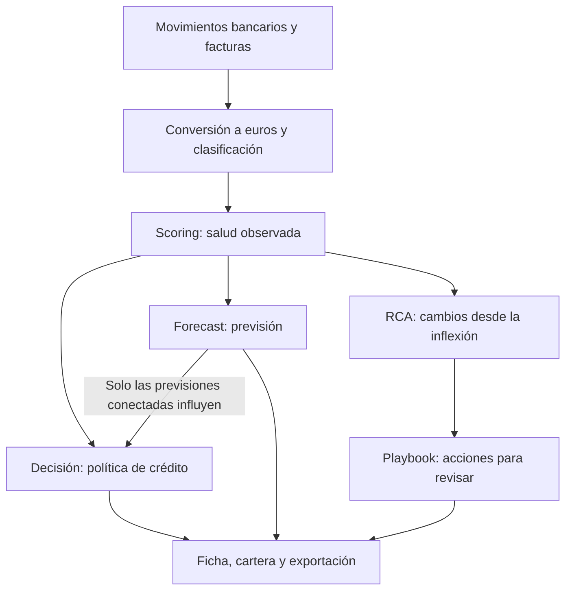

# Cómo entender el producto y sus módulos

El producto ayuda a responder cuatro preguntas sobre una empresa: cómo está su
tesorería, qué podría pasar si continúa su evolución, qué financiación permite
la política del banco y qué aspectos conviene revisar para mejorar.

Esta guía está pensada para aquellos que no han participado en el proyecto. Los nombres entre comillas invertidas son los campos que encontrarán los desarrolladores en los resultados.

## Una explicación de un minuto

«Partimos de movimientos bancarios y facturas. Medimos la salud de la empresa y
la cantidad de información disponible. Después estudiamos cómo influye su grupo
empresarial y calculamos una previsión. La política de crédito decide si hay una
oferta y con qué condiciones. Finalmente, el playbook resume qué ha mejorado,
qué ha empeorado y qué conviene revisar.»

Una puntuación de 70 no significa un 70 % de probabilidad de devolver un préstamo.
Es una posición en una escala de salud financiera. La oferta depende también de
los controles de riesgo, de la confianza en los datos y de la evolución mensual.

## Qué aporta cada módulo

| Módulo               | Pregunta que responde                                               | Resultado principal                          | Documento                                       |
| -------------------- | ------------------------------------------------------------------- | -------------------------------------------- | ----------------------------------------------- |
| Scoring              | ¿Cómo está la empresa al cierre del mes?                            | Puntuaciones, confianza, estados y señales   | [Motor de scoring](../engines/scoring-engine.md)         |
| Forecast o previsión | ¿Qué nota tendría si continuaran los cambios observados?            | Previsiones a 3 y 6 meses e intervalos       | [Motor de previsión](../engines/forecast-engine.md)      |
| Decisión             | ¿Qué oferta permite nuestra política?                               | Elegibilidad, límite, plazo, precio y acción | [Motor de decisión](../engines/decision-engine.md)       |
| RCA y playbook       | ¿Qué cambió desde el giro de la trayectoria y qué conviene revisar? | Hallazgos y recomendaciones                  | [Playbook de tesorería](../engines/treasury-playbook.md) |

El playbook usa la historia del scoring. No espera a que el banco conceda
financiación y no cambia el resultado de la decisión.

## Cómo leer una ficha de empresa

1. **Comprobar la información disponible.** Una empresa con poca evidencia puede
  conservar una nota numérica interna, pero debe explicarse como «no evaluable».
2. **Leer la salud autónoma.** `scoreSolo` resume los datos propios de la empresa.
  Sus tres bloques muestran caja y deuda, cumplimiento de pagos y relaciones comerciales.
3. **Revisar las señales concretas.** Una media aceptable puede convivir con
  facturas vencidas o falta de pagos recurrentes.
4. **Examinar el grupo empresarial.** `scoreGrupo` es la nota de esa misma empresa
  después de considerar apoyo o presión del grupo. No es una nota consolidada del grupo.
5. **Leer la previsión y su estado de uso.** En «modo sombra» se muestra como
  escenario, pero no cambia las condiciones de crédito.
6. **Consultar la decisión.** Mirar controles fallidos, límite recomendado,
  límite vigente, plazos y condiciones de aval.
7. **Pasar al playbook.** Utilizar las recomendaciones como puntos de revisión
  para la empresa, apoyados en cambios observados.

## Conceptos que suelen confundirse

| Concepto          | Explicación sencilla                                          | Lo que no podemos concluir                                             |
| ----------------- | ------------------------------------------------------------- | ---------------------------------------------------------------------- |
| Score             | Nota de salud entre 0 y 100                                   | Que una nota de 80 implique una aprobación o una probabilidad del 80 % |
| Confianza         | Cuánta evidencia útil respalda el cálculo                     | Que una confianza de 0,8 garantice un 80 % de acierto                  |
| Banda             | Tramo numérico A, B, C o D                                    | Que banda A equivalga automáticamente al estado «sana»                 |
| Estado            | Diagnóstico que combina nota y señales de riesgo              | Que pueda deducirse solo mirando el histograma                         |
| Tendencia         | Cambio respecto a meses anteriores                            | Que vaya a continuar necesariamente                                    |
| Inflexión         | Giro que cumple las reglas de confirmación                    | Que identifique una decisión concreta de la dirección                  |
| Forecast          | Proyección condicionada a que continúe la evolución observada | Que sea un compromiso sobre el futuro                                  |
| Límite vigente    | Límite mantenido por el motor en su simulación mensual        | Que ese dinero haya sido solicitado o dispuesto realmente              |
| Score recuperable | Escenario aritmético de recuperación de aportaciones          | Que la empresa vaya a alcanzar esa nota en una fecha determinada       |

## Un ejemplo para una reunión

Dos empresas cierran con 67 puntos. Una ha pasado de 50 a 66; la otra, de 75 a
67. La nota autónoma coincide; el holding, la trayectoria y la oferta no.
Después hay un grupo donde una filial absorbe capital y otra lo pierde, y un
tercer par a 59 puntos donde una puede pedir circulante y la otra no.

Una forma prudente de explicarlo es: «La nota no es la empresa. El sistema
muestra qué evidencia la sostiene, qué hace el grupo y qué permiten las
puertas de crédito». Los [casos de demo](../demo/use_cases/README.md) desarrollan
diecisiete fichas con cifras del run; el [guion de 90 s](../demo/README.md)
elige tres.

## Qué está disponible y qué sigue pendiente

El código calcula scoring, previsión dual, decisiones y RCA. Los parámetros
congelados actuales mantienen ambas previsiones en modo sombra. La cartera lee
resultados importados y materializados en Prisma; los datos de prueba no son un
sustituto automático cuando la base no está disponible.

La clasificación bancaria «prudente / equilibrada / tolerante» aparece en el
diseño anterior, pero no tiene un motor implementado en `lib/features/rca/`.
Además, las acciones de `DecisionRow` son recomendaciones del algoritmo: no
demuestran cómo actuó la empresa. Para valorar esa conducta hace falta evidencia
de decisiones y uso de financiación reales.

La [revisión de correspondencia con el código](./documentation-audit.md) recoge
esta diferencia y otras limitaciones que deben conocerse antes de una demo.

## Ruta de lectura recomendada

- Para un cliente: esta guía y la comparativa de demo.
- Para comprender las cifras: [guía de métricas](../engines/scoring-metrics.md).
- Para mantener el producto: los cuatro documentos de módulo y [SOURCE](./SOURCE.md).
- Para ejecutar el proyecto: [README](../../README.md).
- Para consultar decisiones anteriores: [archivo histórico](../history/README.md).

## Mapa de código para quien se incorpore

| Carpeta                    | Archivos por los que empezar                                                     |
| -------------------------- | -------------------------------------------------------------------------------- |
| `lib/features/scoring/`    | `types.ts`, `params.ts`, `variables.ts`, `aggregate.ts`, `group.ts`, `engine.ts` |
| `lib/features/forecast/`   | `types.ts`, `trend.ts`, `project.ts`, `recompose.ts`, `fit.ts`, `engine.ts`      |
| `lib/features/decision/`   | `input.ts`, `eligibility.ts`, `limit.ts`, `action.ts`, `engine.ts`               |
| `lib/features/rca/`        | `types.ts`, `contracts.ts`, `engine.ts`                                          |
| `lib/features/submission/` | `types.ts`, `format.ts`, `contracts.ts`                                          |
| `lib/features/portfolio/`  | `load-dataset.ts`, `snapshots.ts`, `source.ts`                                   |

Cada módulo tiene tipos para describir sus datos y contratos Zod para validar
su estructura al entrar o salir del sistema. Un «hash» es una huella que
identifica una configuración: permite detectar que se están mezclando versiones.