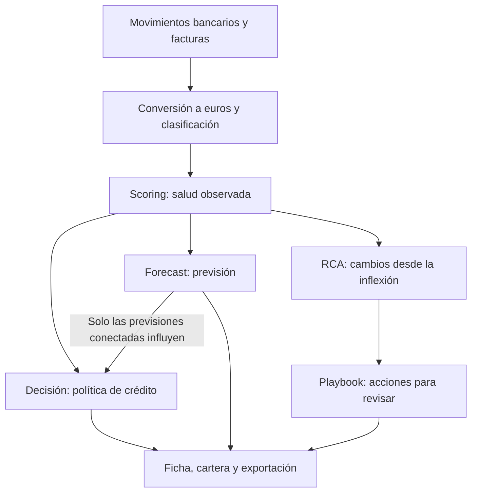

# Cómo entender el producto y sus módulos

Embat Flow responde cuatro preguntas sobre una empresa: cómo está su tesorería,
qué podría pasar si continúa su evolución, qué financiación permite la política
y qué conviene revisar. Esta guía es la explicación de producto para quien no
ha escrito el código. Paquete de entrega: [para el jurado](./para-el-jurado.md).

Los nombres entre comillas invertidas son los campos de los resultados.

## Una explicación de un minuto

Partimos de movimientos bancarios y facturas. Medimos la salud de la empresa y
la cantidad de información disponible. Después estudiamos cómo influye su grupo
empresarial y calculamos una previsión. La política de crédito decide si hay una
oferta y con qué condiciones. Finalmente, el playbook resume qué ha mejorado,
qué ha empeorado y qué conviene revisar.

Una puntuación de 70 no significa un 70 % de probabilidad de devolver un
préstamo. Es una posición en una escala de salud financiera. La oferta depende
también de los controles de riesgo, de la confianza en los datos y de la
evolución mensual.

## Qué aporta cada módulo

| Módulo         | Pregunta que responde                                               | Resultado principal                          | Documento                                                |
| -------------- | ------------------------------------------------------------------- | -------------------------------------------- | -------------------------------------------------------- |
| Scoring        | ¿Cómo está la empresa al cierre del mes?                            | Puntuaciones, confianza, estados y señales   | [Motor de scoring](../engines/scoring-engine.md)         |
| Forecast       | ¿Qué nota tendría si continuaran los cambios observados?            | Previsiones a 3 y 6 meses e intervalos       | [Motor de previsión](../engines/forecast-engine.md)      |
| Decisión       | ¿Qué oferta permite nuestra política?                               | Elegibilidad, límite, plazo, precio y acción | [Motor de decisión](../engines/decision-engine.md)       |
| RCA y playbook | ¿Qué cambió desde el giro de la trayectoria y qué conviene revisar? | Hallazgos y recomendaciones                  | [Playbook de tesorería](../engines/treasury-playbook.md) |

El playbook usa la historia del scoring. No espera a que el banco conceda
financiación y no cambia el resultado de la decisión. En los parámetros
congelados de esta entrega, las previsiones están en **modo sombra**: se
calculan y se muestran, y no modifican la oferta.

## Cómo leer una ficha de empresa

1. **Comprobar la información disponible.** Una empresa con poca evidencia puede
   conservar una nota numérica interna, pero debe explicarse como «no evaluable».
2. **Leer la salud autónoma.** `scoreSolo` resume los datos propios. Sus tres
   bloques muestran caja y deuda, cumplimiento de pagos y relaciones comerciales.
3. **Revisar las señales concretas.** Una media aceptable puede convivir con
   facturas vencidas o falta de pagos recurrentes.
4. **Examinar el grupo.** `scoreGrupo` es la nota de esa misma empresa después
   de considerar apoyo o presión del holding. No es una nota consolidada del grupo.
5. **Leer la previsión y su estado de uso.** En modo sombra es un escenario, no
   un recorte de condiciones.
6. **Consultar la decisión.** Controles fallidos, límite recomendado, límite
   vigente, plazos y condiciones de aval.
7. **Pasar al playbook.** Recomendaciones como puntos de revisión, apoyados en
   cambios observados.

## Conceptos que suelen confundirse

| Concepto          | Explicación sencilla                                   | Lo que no podemos concluir                                 |
| ----------------- | ------------------------------------------------------ | ---------------------------------------------------------- |
| Score             | Nota de salud entre 0 y 100                            | Que 80 implique una aprobación o una probabilidad del 80 % |
| Confianza         | Cuánta evidencia útil respalda el cálculo              | Que 0,8 garantice un 80 % de acierto                       |
| Banda             | Tramo numérico A, B, C o D                             | Que banda A equivalga al estado «sana»                     |
| Estado            | Diagnóstico que combina nota y señales de riesgo       | Que se deduzca solo del histograma                         |
| Tendencia         | Cambio respecto a meses anteriores                     | Que vaya a continuar necesariamente                        |
| Inflexión         | Giro que cumple las reglas de confirmación             | Que identifique una decisión de la dirección               |
| Forecast          | Proyección si continúa la evolución observada          | Que sea un compromiso sobre el futuro                      |
| Límite vigente    | Límite mantenido por el motor en su simulación mensual | Que ese dinero se haya solicitado o dispuesto              |
| Score recuperable | Escenario aritmético de recuperación de aportaciones   | Que la empresa vaya a alcanzar esa nota en una fecha       |

## Un ejemplo para una reunión

Dos empresas cierran con 67 puntos. Una ha pasado de 50 a 66; la otra, de 75 a 67. La nota autónoma coincide; el holding, la trayectoria y la oferta no.
Después hay un grupo donde una filial absorbe capital y otra lo pierde.

«La nota no es la empresa. El sistema muestra qué evidencia la sostiene y qué
hace el grupo.» Los [casos de uso](../demo/README.md) son esos dos pares. El
resto de situaciones (puertas, impago, forecast, datos, aval, pignoración)
está en [casos factibles](../demo/use_cases_factibles/README.md): el producto
las cubre; no están grabadas.

## Qué está disponible y qué no

El código calcula scoring, previsión, decisión y RCA. La cartera lee resultados
importados en Prisma; si la base no tiene un run compatible, las pantallas no
inventan datos.

Pendiente de no vender como hecho:

- Las previsiones congeladas están en modo sombra.
- El opt-in de «pedir circulante» es de demostración (sesión del navegador); la
  cartera del partner aún lista el dataset.
- Las acciones de `DecisionRow` son recomendaciones del algoritmo, no el uso
  real de una línea.
- La clasificación bancaria «prudente / equilibrado / tolerante» no tiene motor
  en `lib/features/rca/`.

La [auditoría](./documentation-audit.md) lista esas diferencias con más detalle.
No forma parte de la lectura del jurado.

## Ruta de lectura

- Entrega: [para el jurado](./para-el-jurado.md), esta guía, [métricas](../engines/scoring-metrics.md) §1–2 y los [casos de uso](../demo/README.md).
- Brief de producto: [PRODUCT.md](./PRODUCT.md).
- Cifras de una ficha: el resto de la guía de métricas.
- Cálculo: los cuatro documentos de [engines/](../engines/) y [SOURCE](./SOURCE.md).
- Arranque del repo: [README](../../README.md).

## Mapa de código

| Carpeta                   | Por dónde empezar                                                    |
| ------------------------- | -------------------------------------------------------------------- |
| `lib/features/scoring/`   | `params.ts`, `variables.ts`, `aggregate.ts`, `group.ts`, `engine.ts` |
| `lib/features/forecast/`  | `params.ts`, `project.ts`, `engine.ts`                               |
| `lib/features/decision/`  | `params.ts`, `eligibility.ts`, `limit.ts`, `action.ts`, `engine.ts`  |
| `lib/features/rca/`       | `types.ts`, `engine.ts`                                              |
| `lib/features/portfolio/` | `source.ts`, `snapshots.ts`                                          |
| `app/(panel)/`            | `cartera/`, `empresa/`, `grupos/`                                    |

Cada módulo valida su contrato con Zod. Un hash identifica la configuración y
evita mezclar versiones.
